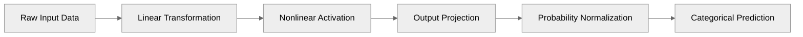
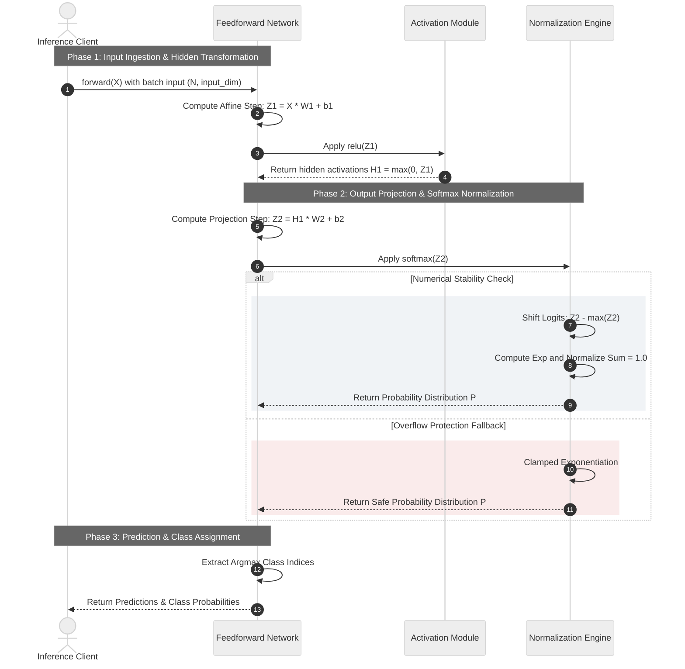
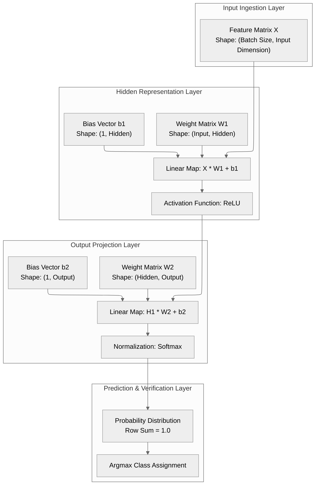
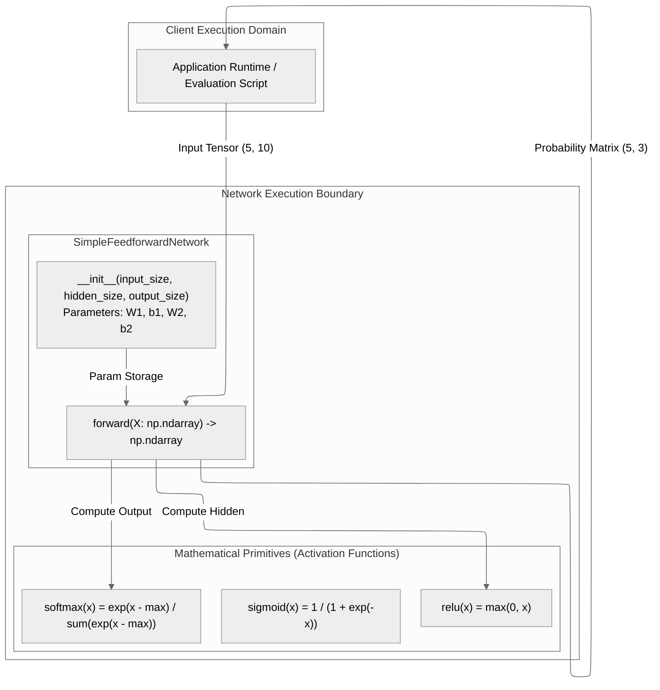

# NN-Fundamental

> Modular from-scratch neural network implementation in Python and NumPy engineered to demonstrate core mathematical foundations, multi-layer forward propagation, and categorical classification dynamics.


NN-Fundamental is a transparent, zero-dependency machine learning foundation library designed to illuminate neural network operations from raw matrix transformations to normalized probability distributions. It provides a crystal-clear reference architecture for developers and machine learning practitioners seeking deep, bottom-up mastery of artificial intelligence primitives.

---

## 1. End-to-End Pipeline Overview



---

## 2. Core Purpose & Business Value

NN-Fundamental translates abstract mathematical modeling into high-trust operational assets by ensuring predictable computation, reducing third-party software risks, and guaranteeing full algorithmic transparency.

- **Predictable Operational Decision Making**: Delivers consistent, deterministic categorization of customer inputs and operational telemetry, empowering decision-makers with confident automated triage.
- **Zero-Dependency Cost Reduction**: Eliminates reliance on heavy external platform runtimes, significantly lowering hardware provisioning costs and eradicating cloud resource waste.
- **Flawless Enterprise Auditability**: Provides complete operational transparency where every intermediate data state can be mathematically inspected, satisfying governance and compliance benchmarks.
- **High-Velocity Prototyping & Retention**: Empowers engineering teams to rapidly test custom classification logic and validate assumptions without complex runtime setup delays.

---

## 3. System Architecture & Technical Execution

The architecture separates linear layer transformations, nonlinear activation gating, and probability normalization into decoupled modules to ensure numerical stability and rigorous state inspection.

### Core Concept & Phased Execution Sequence



### High-Level Target Production Architecture



### Execution Boundary & Component Isolation Design



---

## 4. Repository Structure

```text
NN-Fundamental/
├── 1.FFN/
│   └── main.py          # Feedforward neural network, activations, and test execution
├── 2.CNN/
│   └── main.py          # Convolutional neural network, spatial pooling, and test execution
├── 3.RNN/
│   └── main.py          # Recurrent neural network, sequence dynamics, and test execution
├── .gitignore           # Environment and cache artifact ignore rules
├── pyproject.toml       # Project metadata and dependency specification
├── requirements.txt     # Standard dependency pin (numpy>=1.24.0)
├── ruff.toml            # Linter and formatter configuration
├── uv.lock              # Deterministic uv dependency lockfile
└── README.md            # Architecture documentation and execution guide
```

---

## 5. Quickstart

### Setup & Synchronization with `uv`

```powershell
# Sync virtual environment and dependencies
uv sync
```

### Run Demonstrations

```powershell
# Run Feedforward Network
uv run python 1.FFN/main.py

# Run Convolutional Neural Network
uv run python 2.CNN/main.py

# Run Recurrent Neural Network
uv run python 3.RNN/main.py
```

